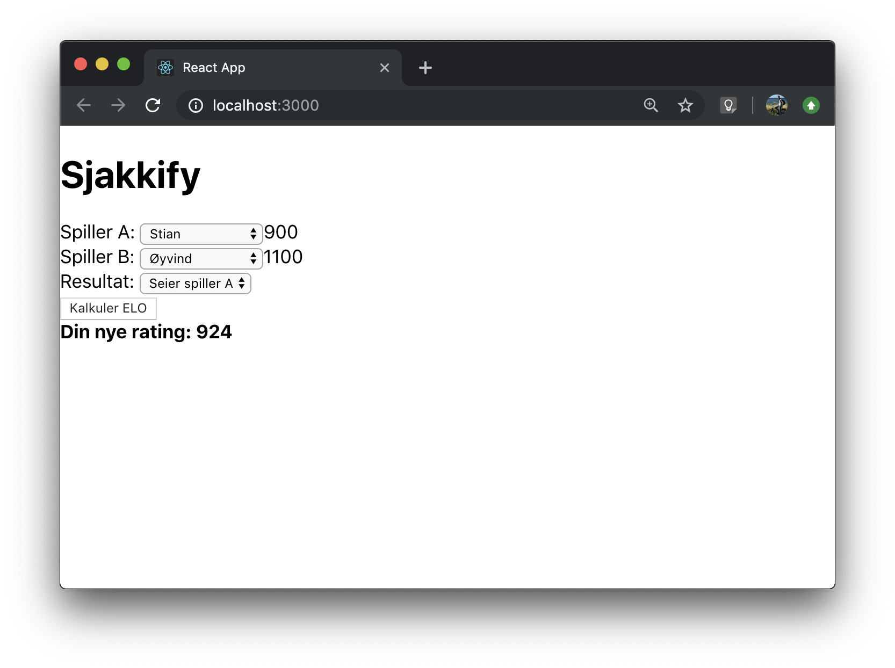

# Oppgave for Front-end-utviklere

Sjakk er moro. Men, det er enda morsommere å lage en app som kan holde styr på hvem på kontoret som er den beste sjakkspilleren.

Derfor har vi satt opp to endpoints: Étt for å hente ut sjakkspillerne på kontoret og [ELO-scoren](https://en.wikipedia.org/wiki/Elo_rating_system) deres, og ett for å kalkulere den oppdaterte ELO-scoren når en match har blitt spilt.

Oppgaven går derfor ut på å ta i bruk disse to endpointene for å "spille en match" og vise den oppdaterte ELO-scoren i en React-app.

Når vi sier "spille en match", trenger du ikke få panikk, for du skal ikke implementere en sjakk-computer. Det vi trenger er et skjema hvor man velger Spiller A, så velger Spiller B, velger utfallet av kampen (tap Spiller A, uavgjort eller seier Spiller A) og til slutt trykker på en eller annen knapp for å kalkulere Spiller A sin oppdaterte ELO-score.

## Eksempel



## Kravspekk

- Man skal velge Spiller A og Spiller B fra en liste over spillere som hentes herfra: https://us-central1-chessscore.cloudfunctions.net/getEloScoreBoard
- Man skal bruke `rating` for Spiller A og Spiller B fra spillerobjektene som hentes fra endpointet over for å kalkulere ny ELO for Spiller A ved å bruke følgende endpoint: https://us-central1-chessscore.cloudfunctions.net/getNewRating
- Ratingen som kalkuleres må formateres slik: `Din nye rating: ${rating}` for at testen skal godkjennes.
- Oppgaven er fullført når begge tester i `src/App.test.js` er godkjent.

### Hvordan bruker du endpointet som gir deg ny ELO-rating?

```
GET https://us-central1-chessscore.cloudfunctions.net/getNewRating?myRating
```

Resultatet vil kun påvirke `myRating` (Spiller A).

| Query param       |  type  |       value       |                                description                                 |
| ----------------- | :----: | :---------------: | :------------------------------------------------------------------------: |
| myRating \*       | number |                   |                                                                            |
| opponentRating \* | number |                   |                                                                            |
| myGameResult \*   | number | `0`, `0.5` or `1` | `0` er Tap for spiller A, `0.5` er uavgjort, og `1` er seier for spiller A |

Eksempelbruk:

`https://us-central1-chessscore.cloudfunctions.net/getNewRating?myRating=800&opponentRating=1200&myGameResult=1`

Dette endpointet tilsier at spiller A har vunnet, og får dermed tilbake en ny ELO-rating som ser slik ut:

```json
{
  "newRating": 829
}
```

## Oppsett

For å løse denne oppgaven trenger du følgende:

- [Node](https://nodejs.org/en/)
- [NPM](https://docs.npmjs.com/getting-started/)/[Yarn](https://yarnpkg.com/en/docs/getting-started)

1. Last ned dette repoet ved å kjøre `git clone git@github.com:ludens-reklamebyra/front-end-assignment.git`
2. Naviger til prosjektet ved å kjøre `cd front-end-assignment`
3. Installer dependencies ved å kjøre `npm install`, eller `yarn` om du bruker Yarn
4. Kjør testene ved å bruke kommandoen `npm test --silent --no-watch`, eller `yarn test --silent --no-watch` om du bruker Yarn
5. For å kjøre selve webappen bruker du kommandoen `npm start`, eller `yarn start` om du bruker Yarn.
6. Om nødvendig, kan du finne mer utdypende dokumentasjon på `create-react-app` her: https://github.com/facebook/create-react-app

## Handy tips

- Alle endpoints som skal brukes finnes her: `src/util/constants.js`

## Ekstraoppgaver

- Det bør ikke være mulig å spille mot hverandre, hvordan kan man løse det?
- I Ludens bruker vi `TypeScript` i stedet for `JavaScript`, hint hint!

## Hvordan levere

- Du kan enten forke repoet og sende lenken til `stian@ludensreklame.no`
- Eller opprette et helt nytt public repo, pushe koden din, for så å sende lenken til `stian@ludensreklame.no`

Lykke til! Om du har noen spørsmål, ikke nøl med å sende de til `stian@ludensreklame.no`
